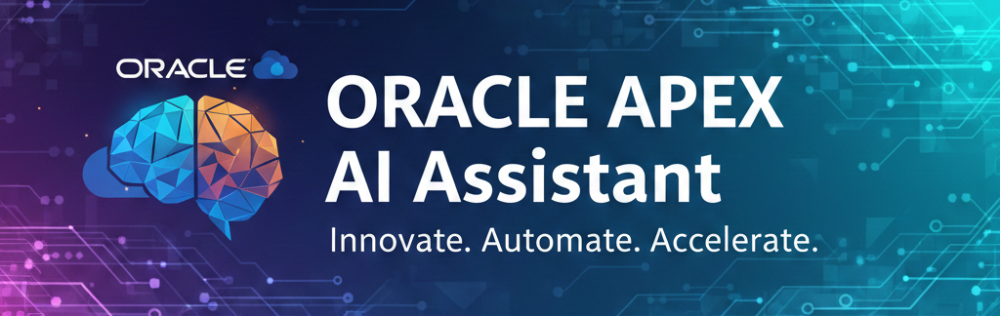

<!-- GitHub Profile: Alaaeldin Abdelmonem -->

  

<h1 align="center">🌐 Entrprise AI Assistant</h1>
<h3 align="center">.</h3>

# Oracle AI Assistant ChatPot

Enterprise-grade RAG chatbot built on Oracle Database 23+ and APEX 24.x

## Features
- 🤖 Multi-provider LLM support (OpenAI, Claude, Gemini)
- 📚 RAG with vector embeddings
- 💬 ChatGPT-like interface
- 🔒 Enterprise security & governance
- 📊 Complete audit trail

## Quick Start
[Installation steps]

## Documentation
See `/docs` folder

## License
MIT

## Contributing
See CONTRIBUTING.md

## 🧑‍💼 Professional Services & Enterprise Support

This project is developed and maintained by **Alaaeldin Abdelmonem**.

Organizations can request:

- Custom AI assistants for Oracle APEX (24.x)  
- Oracle Database 23ai Vector Search & RAG implementation  
- Integration with Oracle E-Business Suite (HR, Payroll, ERP)  
- Governed RAG pipelines (security, audit, classifications)  
- LLM Orchestration (OpenAI, Anthropic, Gemini, OCI GenAI)  
- Multi-tenant SaaS architecture for APEX applications  
- UI/UX development for enterprise APEX systems  
- Enterprise logging, observability, and compliance frameworks  
- Training, documentation, and long-term support  

📩 **Email:** alaa.guru@outlook.com  
💼 **LinkedIn:** https://linkedin.com/in/alaa-eldin  
🌍 **Website:** https://regpulses.godaddysites.com/  

If your organization needs a production-ready AI assistant, professional support is available.
